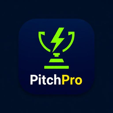

# PitchPro — Sports Event Manager

<div align="center">



**Complete digital toolkit for local sports event organizers**

[](https://web.dev/progressive-web-apps/)
[](https://reactjs.org/)
[](https://www.typescriptlang.org/)
[](https://vitejs.dev/)

[Live Demo](#) • [Report Bug](#) • [Request Feature](#)

</div>

## 🏆 Overview

PitchPro is a Progressive Web Application (PWA) designed specifically for local sports event organizers. Whether you're running football tournaments, cricket matches, or basketball competitions, PitchPro provides everything you need from team registration to trophy presentation—all in one mobile-first application.

Built with modern web technologies, PitchPro works offline, installs like a native app, and provides professional event management capabilities without the complexity of enterprise solutions.

## ✨ Key Features

### 🎯 Event Management
- **Quick Event Creation** - Set up tournaments in under 2 minutes
- **Multi-Sport Support** - Football, cricket, basketball, and more
- **Automated Brackets** - Generate single-elimination tournament brackets
- **Real-time Updates** - Live scoring and match management

### 👥 Team Registration
- **Public Registration Forms** - Shareable forms for team sign-ups
- **Payment Proof Upload** - Teams upload payment screenshots for approval
- **Admin Approval Workflow** - One-click approval of team registrations
- **QR Code Sharing** - Instant sharing to social media and messaging apps

### 🎫 Ticket & Pass Management
- **Event Pass Generation** - Create free or paid passes with QR codes
- **Ticket Sales** - Integrated payment processing and ticket generation
- **QR Validation** - Mobile ticket scanning at entry points
- **Public Ticket Lookup** - Attendees can check ticket status online

### 💰 Financial Management
- **Budget Tracking** - Real-time income, expense, and prize pool monitoring
- **Donation Management** - Log and track sponsor contributions
- **Payment Processing** - Multiple payment method support
- **Financial Reports** - Comprehensive profit and loss statements

### 📱 Event Day Operations
- **Digital Check-in** - QR-based player and attendee verification
- **Match Scheduling** - Automated fixture generation
- **Score Management** - Live score updates and results
- **Offline Capability** - Full functionality without internet connection

## 🚀 PWA Capabilities

### Install & Performance
- **Native App Experience** - Installable on iOS, Android, and desktop
- **Offline First** - Core functionality works without internet
- **Fast Loading** - Optimized bundle with code splitting (387KB initial load)
- **Background Sync** - Automatic data synchronization when online

### Cross-Platform
- **Responsive Design** - Works on phones, tablets, and desktops
- **Touch Optimized** - Designed for mobile-first interaction
- **Browser Compatible** - Works on all modern browsers

## 🛠️ Technology Stack

### Frontend
- **React 19.2.0** - Modern UI framework with concurrent features
- **TypeScript 5.8.3** - Type-safe development
- **Vite 7.3.2** - Fast build tool and development server
- **Tailwind CSS 4.2.1** - Utility-first CSS framework
- **TanStack Router** - Type-safe routing with data loading

### UI Components
- **Radix UI** - Accessible, unstyled components
- **Lucide React** - Beautiful icon library
- **Sonner** - Toast notifications

### Backend & Database
- **Supabase** - PostgreSQL database with real-time features
- **Authentication** - Secure user management
- **Storage** - File uploads for images and documents

### Specialized Libraries
- **QR Code Generation** - `qrcode` and `qrcode.react`
- **QR Scanning** - `html5-qrcode` for camera-based scanning
- **PDF Generation** - `jspdf` for ticket and certificate creation
- **Charts** - `recharts` for data visualization
- **Date Handling** - `date-fns` for date manipulation

## 📦 Installation

### Prerequisites
- Node.js 18+ 
- npm or yarn
- Git

### Quick Start

1. **Clone the repository**
   ```bash
   git clone https://github.com/your-username/pitchpro.git
   cd pitchpro
   ```

2. **Install dependencies**
   ```bash
   npm install
   ```

3. **Set up environment variables**
   ```bash
   cp .env.example .env
   # Edit .env with your Supabase credentials
   ```

4. **Run development server**
   ```bash
   npm run dev
   ```

5. **Open your browser**
   ```
   http://localhost:5173
   ```

### Production Build

```bash
# Build for production
npm run build

# Preview production build
npm run preview

# Analyze bundle size
npm run build -- --analyze
```

## ⚙️ Configuration

### Environment Variables

Create a `.env` file in the root directory:

```env
# Supabase Configuration
VITE_SUPABASE_URL=your_supabase_url
VITE_SUPABASE_ANON_KEY=your_supabase_anon_key

# Optional: Custom Configuration
VITE_APP_NAME=PitchPro
VITE_APP_VERSION=1.0.0
```

### Supabase Setup

1. **Create a new project** at [supabase.com](https://supabase.com)
2. **Run the migration scripts** from `supabase/migrations/`
3. **Set up storage buckets** for images and files
4. **Configure authentication** providers
5. **Update environment variables** with your project details

## 🏗️ Project Structure

```
pitchpro/
├── public/                 # Static assets
│   ├── icon-192.png       # PWA icon
│   ├── icon-512.png       # PWA icon
│   └── manifest.webmanifest # PWA manifest
├── src/
│   ├── components/         # Reusable UI components
│   │   ├── ui/           # Base UI components
│   │   ├── qr-scanner.tsx # QR scanning component
│   │   └── share-dialog.tsx # Social sharing
│   ├── hooks/            # Custom React hooks
│   ├── integrations/      # External service integrations
│   │   └── supabase/    # Supabase client setup
│   ├── lib/              # Utility functions
│   │   ├── store.ts      # State management
│   │   └── currency.ts   # Currency formatting
│   ├── routes/           # Page components
│   └── styles.css        # Global styles
├── supabase/
│   └── migrations/       # Database migrations
└── dist/                # Production build output
```

## 🎯 Usage Guide

### For Event Organizers

1. **Create Account** - Sign up and verify your email
2. **Create Event** - Add sport, dates, venue, and entry fees
3. **Generate QR Code** - Share registration link with teams
4. **Approve Registrations** - Review team submissions and payments
5. **Generate Brackets** - Auto-create tournament brackets
6. **Manage Event Day** - Use check-in and scoring features

### For Team Captains

1. **Scan QR Code** - Or click registration link
2. **Fill Registration** - Add team details and player information
3. **Upload Payment** - Submit payment proof for approval
4. **Track Status** - Check registration status online
5. **Receive Updates** - Get notifications about schedule and results

### For Attendees

1. **Purchase Tickets** - Buy event passes online
2. **Receive QR Code** - Get digital ticket via email/app
3. **Check Status** - Verify ticket status online
4. **Event Entry** - Present QR code for scanning

## 🔧 Development

### Code Quality

```bash
# Lint code
npm run lint

# Format code
npm run format

# Type check
npm run type-check
```

### Bundle Optimization

The app uses advanced bundle optimization:

- **Code Splitting** - Automatic route-based splitting
- **Tree Shaking** - Unused code elimination
- **Lazy Loading** - Heavy components load on-demand
- **Manual Chunks** - Vendor libraries separated
- **Compression** - Gzip and Brotli optimization

### PWA Development

```bash
# Test PWA features
npm run dev
# Open DevTools > Application > Manifest
# Test install prompt and offline functionality
```

## 📊 Performance Metrics

- **First Load:** 387KB (76% smaller than previous)
- **Time to Interactive:** <2 seconds on 3G
- **Lighthouse Score:** 95+ Performance
- **PWA Score:** 100% Installable
- **Offline Support:** Full core functionality

## 🤝 Contributing

We welcome contributions! Please see our [Contributing Guide](CONTRIBUTING.md) for details.

### Development Workflow

1. Fork the repository
2. Create feature branch (`git checkout -b feature/amazing-feature`)
3. Commit changes (`git commit -m 'Add amazing feature'`)
4. Push to branch (`git push origin feature/amazing-feature`)
5. Open Pull Request

### Code Standards

- Use TypeScript for all new code
- Follow ESLint configuration
- Write meaningful commit messages
- Add tests for new features
- Update documentation

## 📝 Roadmap

### Version 1.1 (Q2 2024)
- [ ] Multi-language support
- [ ] Advanced bracket formats
- [ ] Live streaming integration
- [ ] Mobile app store release

### Version 1.2 (Q3 2024)
- [ ] Payment gateway integrations
- [ ] Advanced analytics dashboard
- [ ] API for third-party integrations
- [ ] White-label options

### Version 2.0 (Q4 2024)
- [ ] Mobile companion apps
- [ ] Real-time scoring
- [ ] Video highlights
- [ ] Sponsor marketplace

## 🐛 Troubleshooting

### Common Issues

**PWA Not Installing**
- Ensure HTTPS in production
- Check manifest configuration
- Verify service worker registration

**QR Scanner Not Working**
- Check camera permissions
- Ensure HTTPS connection
- Test on different browsers

**Offline Mode Issues**
- Clear browser cache
- Reinstall PWA
- Check service worker status

### Support

- **Documentation:** [Wiki](https://github.com/your-username/pitchpro/wiki)
- **Issues:** [GitHub Issues](https://github.com/your-username/pitchpro/issues)
- **Discussions:** [GitHub Discussions](https://github.com/your-username/pitchpro/discussions)
- **Email:** support@pitchpro.app

## 📄 License

This project is licensed under the MIT License - see the [LICENSE](LICENSE) file for details.

## 🙏 Acknowledgments

- **React Team** - For the amazing React framework
- **Supabase** - For the excellent backend-as-a-service
- **Vite Team** - For the lightning-fast build tool
- **Radix UI** - For accessible component primitives
- **Local Event Organizers** - For feedback and requirements

## 📞 Contact

- **Website:** [pitchpro.app](https://pitchpro.app)
- **Email:** hello@pitchpro.app
- **Twitter:** [@PitchProApp](https://twitter.com/PitchProApp)
- **LinkedIn:** [PitchPro](https://linkedin.com/company/pitchpro)

---

<div align="center">

**Made with ❤️ for local sports organizers**

[⭐ Star this repo](https://github.com/your-username/pitchpro) • [🐦 Follow us](https://twitter.com/PitchProApp)

</div>
